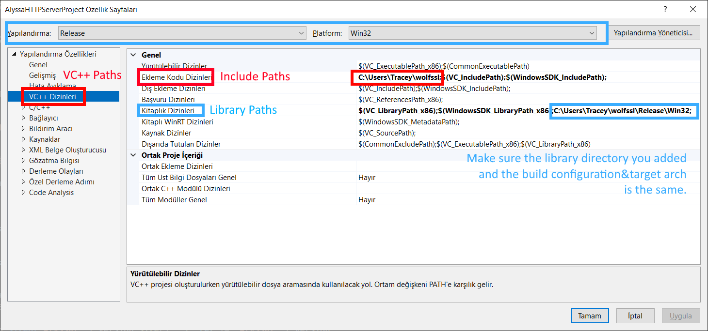
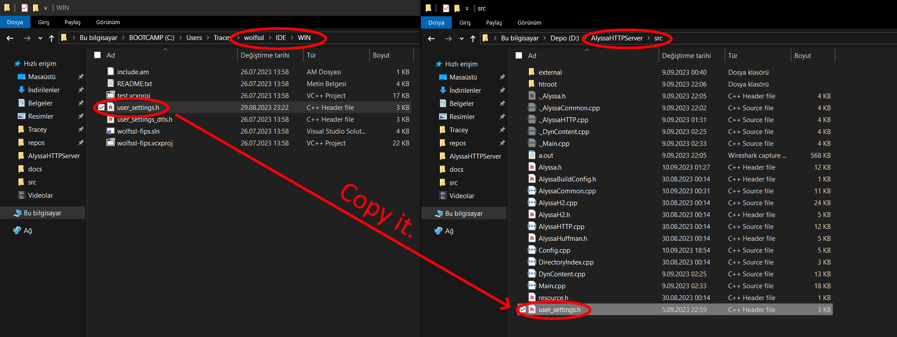

# Compilation
Before compiling, set which features will be compiled from `AlyssaBuildConfig.h`

- SSL support requires compiled WolfSSL library, which Alyssa HTTP Server uses. 
Steps related to SSL is indicated with '(SSL)' on them.
- Deflate compression requires compiled zlib library. Steps related to it is indicated with '(zlib)'
## Windows (Visual Studio)

### 1. Add WolfSSL directories to VS Project (SSL)
Open Project Settings and go to VC++ Paths, and add library and include paths as shown.
>[!NOTE]
> Make sure the library path you added and your build config&target architecture is same.


### 2. Copy user_settings.h from WolfSSL to src directory. (SSL)
It is located on 'IDE\WIN' folder.

### 3. Add zlib include and library paths to VS project (zlib)
This one is same as step 1. You need to add path of "zlib.h" to include and "zlib.lib" to library path.
### 4. Hit the compile button
This one is self explainatory.

## Other platforms (GCC)
You can just fire up a terminal in src folder and compile with GCC. Here's the base command for it:
```
g++ -std=c++17 *.cpp external/*.cpp -fpermissive -lstdc++ -lstdc++fs -lpthread -lwolfssl
```
You can modify the command for your needs or considering these:
- external/*.cpp is broad and will compile unnecessary things if you don't want to compile all features. Set only the ones you need.
- `-lwolfssl` will link with WolfSSL library, remove that if you don't compile with SSL support.
- you can link statically by adding `-static`
- Should work on Clang too.